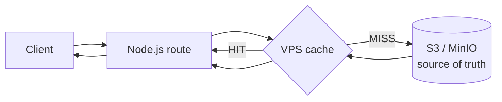

# VPS File Cache — Architecture

Phase 1 of the storage/usage/pricing upgrade. This document covers the VPS
filesystem cache that sits in front of object storage. S3/MinIO remains the
**source of truth**; the cache is a delivery accelerator that can be wiped at any
time with no data loss.

## Why

The app streams object bytes **through itself** — it never 302-redirects to a
presigned URL, because the object store is internal (`127.0.0.1`) and unreachable
by external visitors (see `lib/link-handler.ts`). That means every download is an
S3/MinIO `GET` + data-transfer. A hot file (e.g. a logo on a public link) would be
re-fetched from S3 on every request. The cache serves repeat reads from local
disk instead, eliminating the S3 `GET` and egress for cache hits.



## Where it lives

| Piece | File |
|---|---|
| Cache service (get/invalidate/evict/purge/stats) | `lib/cache.ts` |
| Cache index model (LRU/TTL/observability) | `models/CacheEntry.ts` |
| Cleanup cron (TTL purge + LRU eviction) | `app/api/internal/cron/cache-cleanup/route.ts` |
| Admin stats + manual clear | `app/api/v1/admin/cache/route.ts` |
| Wired read paths | `lib/link-handler.ts`, `app/api/v1/files/[id]/download/route.ts` |
| Invalidation on delete/replace | `app/api/internal/cron/purge-trash/route.ts`, `app/api/v1/files/[id]/content/route.ts` |
| Env | `lib/env.ts`, `.env.example`, `scripts/setup.sh` |
| Cron registration | `scripts/setup.sh`, `scripts/setup-cron.sh` |
| Pure-logic tests | `tests/cache-logic.test.js` |

## How a read works

`getObjectCached(storageKey, { mimeType, sizeHint })` returns the same shape as
`storage.getObject()` plus a `cache: 'HIT' | 'MISS' | 'BYPASS'` verdict.

1. **Bypass check** (`shouldBypass`): if the cache is disabled, the driver is
   `disk` (primary already local), or the file is larger than
   `FILE_CACHE_MAX_FILE_SIZE_MB`, stream straight from storage.
2. **Lookup**: find the `CacheEntry` for the key. If present, not expired, and the
   file exists on disk → **HIT**: bump `lastAccessAt`/`hits` (non-blocking) and
   return a read stream from disk.
3. **Miss**: `populate()` fetches the object from storage **once** (single-flight),
   streams it to a temp file, atomically renames it into place, and upserts the
   `CacheEntry`. Then the caller reads the freshly-written file.
4. **Fault tolerance**: any error in the cache path degrades to a direct
   `storage.getObject()` read — the cache can never make a download fail.

Everything is **streamed** — a large object is piped to disk and read back as a
stream; it is never buffered wholly in RAM.

### Single-flight

Concurrent misses for the same key are coalesced through an in-process
`Map<key, Promise>`. Only the first request fetches from S3; the rest await it and
then read the written file. The temp-file + atomic-rename write means that even
across multiple Node processes a partially-written file is never served — the
worst case for multi-process is a duplicate fetch, never corruption.

## Versioning / staleness

Cache keys are the **storage keys**, which embed the `fileId` and never change
content: editing a file writes a **new** storage key (`lib/.../content` `PUT`),
and dedup only ever points multiple rows at an existing immutable object. So there
is no cache-invalidation race for normal reads. For safety, `invalidate(key)` is
called when an object is actually removed from storage:

- `purge-trash` cron — when a trashed file's object is deleted (ref-count 0).
- `content` `PUT` — when a replaced file's old object is reclaimed (ref-count 0).

## Eviction & TTL

- **TTL** per content class (`image` / `video` / `document` / `other`), configured
  in seconds. Expired entries are purged by the cleanup cron (which unlinks the
  file first, then removes the row — a Mongo TTL index would orphan files, so it
  is intentionally **not** used).
- **LRU eviction** bounded by `FILE_CACHE_MAX_SIZE_GB`. When total cached bytes
  exceed the max, oldest-accessed entries are evicted down to 90% (low-water) so
  the cache doesn't thrash one-object-per-write near the limit. Eviction runs
  opportunistically after each write (non-blocking) and on the 15-minute cron.

## Observability

`GET /api/v1/admin/cache` (permission `admin:usage:read`) returns:

```
enabled, bypassed, driver, entries, totalBytes, maxBytes, usagePercent, hitRate,
counters { hits, misses, bypass, errors, fetchBytes, savedBytes, evictions, evictedBytes },
config { maxSizeGB, maxFileSizeMB, ttlSeconds }
```

`DELETE /api/v1/admin/cache` (permission `admin:maintenance:toggle`, i.e.
super_admin) clears the entire cache. `savedBytes` is the bytes served from cache
(i.e. S3 egress avoided); `fetchBytes` is what was actually pulled from S3.

## Configuration

All values have safe defaults and none are required. See `.env.example` for the
canonical list.

| Var | Default | Meaning |
|---|---|---|
| `FILE_CACHE_ENABLED` | `true` | Master switch |
| `FILE_CACHE_ROOT` | `/var/cache/file-manager` | Where cached bytes live |
| `FILE_CACHE_MAX_SIZE_GB` | `5` | Hard cap (LRU eviction keeps under this) |
| `FILE_CACHE_MAX_FILE_SIZE_MB` | `256` | Files bigger than this are never cached |
| `FILE_CACHE_DEFAULT_TTL_SECONDS` | `86400` | TTL for `other` |
| `FILE_CACHE_IMAGE_TTL_SECONDS` | `604800` | TTL for images |
| `FILE_CACHE_DOCUMENT_TTL_SECONDS` | `86400` | TTL for documents |
| `FILE_CACHE_VIDEO_TTL_SECONDS` | `259200` | TTL for video |
| `FILE_CACHE_TEMP_TTL_SECONDS` | `3600` | Reserved for short-lived artifacts |

> **Local dev note:** the default `STORAGE_DRIVER=disk` **bypasses** the cache
> entirely (the primary copy is already local). The cache only activates for
> `STORAGE_DRIVER=s3` / `minio`. To exercise HIT/MISS locally, point storage at a
> MinIO instance.

## Known trade-offs (reviewed & accepted)

An adversarial multi-lens review (concurrency, eviction/TTL, streaming/faults,
security/isolation, integration) raised and then refuted several theoretical
races; none manifest on the Linux target. The accepted trade-offs:

- **Lazy fd open on a cache stream.** `fs.createReadStream` opens its fd on the
  next tick, after `getObjectCached` returns. In principle a concurrent unlink
  (evict/clear/invalidate) could land in that sub-millisecond window. In practice
  the open is dispatched immediately with no preceding I/O while every removal is
  gated behind DB round-trips, so the open always wins; and on Linux an open fd
  pins the inode, so a following unlink can't break the read. Left as-is to keep
  the download hot path simple.
- **Self-healing orphans.** If a cron unlink and a concurrent `populate()` race,
  at most one on-disk file per key can briefly exist uncounted; the next read of
  that key (or `invalidate`/`clearAll`) reclaims it via the atomic-rename
  overwrite. Cache size is still bounded by LRU eviction.
- **Bounded cron batches.** `purgeExpired` (5000/run) and `evictIfNeeded`
  (2000/run) drain large backlogs across successive 15-minute ticks rather than
  in one long request.

## Verification status (Phase 1)

- ✅ Pure-logic unit tests (`tests/cache-logic.test.js`, `npm test`): mimeClass,
  TTL selection, expiry boundary, bypass policy, sharded/traversal-free paths,
  LRU eviction math.
- ✅ Typecheck: no new errors introduced.
- ✅ Production build compiles the new routes/service.
- ⏳ **Live HIT/MISS against S3/MinIO**: deferred — requires `STORAGE_DRIVER=s3`
  and object-store credentials (see the AWS setup doc in a later phase). The disk
  driver used in local dev bypasses the cache by design.
